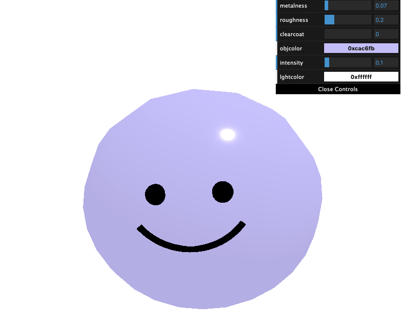

# cute

Small utility to test a design framework for designing cute 3D objects.


Clear coat material technique from [this repo](https://github.com/kellymilligan/codrops-oct-2021-final)

## Setup
Template code adapted from a lesson in [three.js journey](https://threejs-journey.com).

Download [Node.js](https://nodejs.org/en/download/).
Run this followed commands:

``` bash
# Install dependencies (only the first time)
npm install

# Run the local server at localhost:8080
npm run dev

# Build for production in the dist/ directory
npm run build
```
